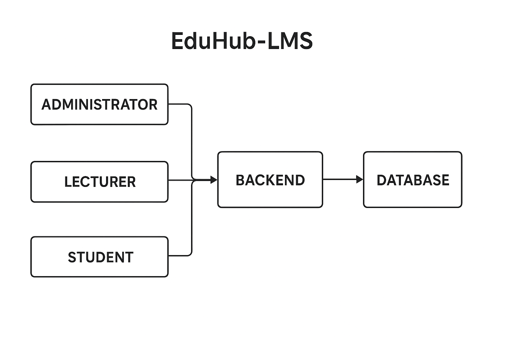

# EDUHUB-LMS  
### Project Documentation Report  
**Student:** Jeremy Akoko  
**Course:** Bachelor of Science in Computer Science  
**Institution:** Mount Kenya University  
**Project Title:** Development of a Learning Management System (EduHub-LMS)  
**Year:** 2024  

---

## 1. Introduction
In many educational institutions across Kenya, the management of academic processes such as class scheduling, resource sharing, and student tracking remains largely manual. This creates inefficiencies that affect both staff and learners.  
EduHub-LMS was developed as a prototype system to demonstrate how digital learning platforms can improve efficiency, transparency, and access to educational resources within an institution.

---

## 2. Problem Statement
Traditional learning management in universities and colleges often involves paperwork, manual attendance tracking, and unstructured resource sharing.  
These methods lead to delays, data loss, and miscommunication between lecturers and students.  
The absence of a centralized system makes it difficult to coordinate courses, track student performance, and store learning materials efficiently.

---

## 3. Project Objectives
### General Objective
To develop an efficient Learning Management System that centralizes academic operations for lecturers, students, and administrators.

### Specific Objectives
- To design and implement a structured database for managing student and lecturer information.  
- To automate class scheduling and attendance tracking.  
- To facilitate easy uploading and access of learning resources.  
- To generate performance and attendance reports automatically.  
- To enhance communication and collaboration among academic stakeholders.

---

## 4. Methodology
The project adopted a **System Development Life Cycle (SDLC)** approach, specifically the **Iterative Model**, which allowed for co
ch
---

## 5. System Design

This section explains how the EduHub-LMS is structured to support its key objectives of improving academic organization and team collaboration.

### Key Modules
- **User Management Module** – Handles registration, authentication, and access levels for administrators, lecturers, and students.
- **Course Management Module** – Tracks courses, assigned lecturers, class schedules, and student enrollments.
- **Resource Library Module** – Manages academic materials such as notes, assignments, and e-books.
- **Reports and Analytics Module** – Generates performance summaries, attendance reports, and usage insights.

### System Architecture

Below is the system architecture diagram for EduHub-LMS:

---

## 6. System Requirements

### Hardware Requirements
- Processor: Intel Core i3 or higher  
- Memory: Minimum 4GB RAM  
- Storage: 500GB HDD or SSD recommended  
- Display: 1366x768 resolution or higher  

### Software Requirements
- Operating System: Linux (Ubuntu/Kubuntu) or Windows 10+  
- Web Server: Apache or Nginx  
- Backend: PHP or Python (Flask/Django)  
- Database: MySQL or PostgreSQL  
- Version Control: Git and GitHub  
- Browser: Brave or Chrome  

---

## 7. Implementation and Testing

The system was implemented using a modular approach, ensuring that each component was tested individually and integrated progressively.  
Testing involved:
- **Unit testing:** verifying individual functions.  
- **Integration testing:** ensuring modules work together.  
- **User acceptance testing:** confirming system usability by lecturers and students.

---

## 8. Conclusion and Recommendations

EduHub-LMS successfully demonstrates how technology can streamline academic operations. Future improvements include:
- Integration with mobile platforms.
- Real-time notifications.
- Enhanced analytics dashboards for performance tracking.

---

**Prepared by:** *Jeremy Akoko*  
**Reg. No:** [dbit/2024/46280]  
**Course:** *BSc. Computer Science*  
**Institution:** *Mount Kenya University*  
**Year:** *2024*
